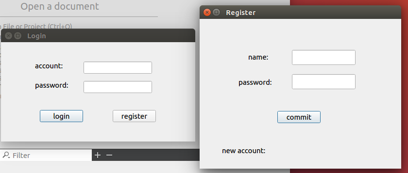
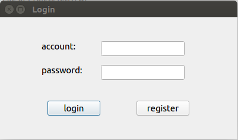
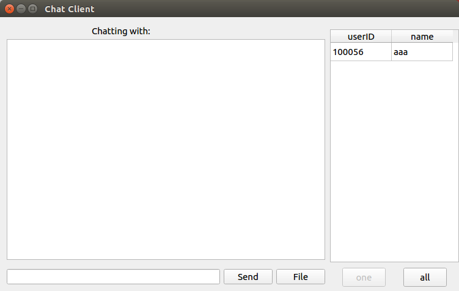
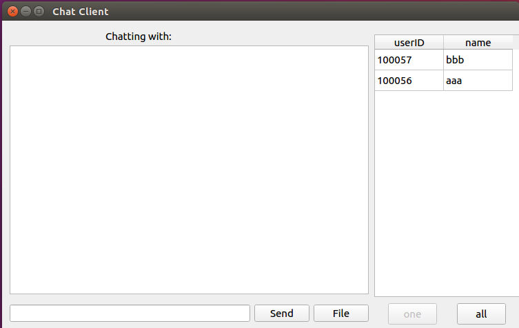
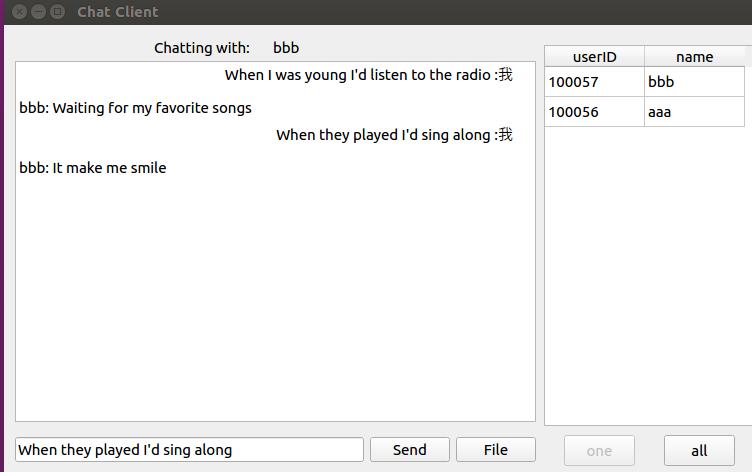
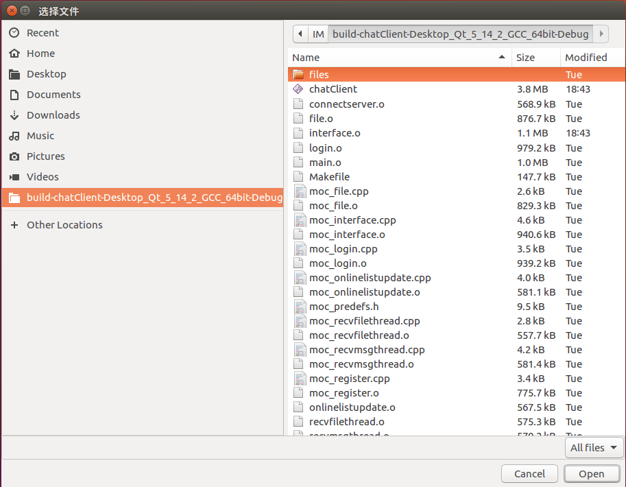
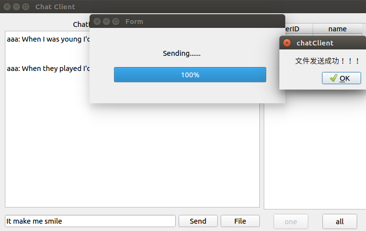

# 基于QT的互联网即时通讯软件

因为服务器是linux服务器，为了方便本地的开发测试，所以客户端也是运行在linux环境下，使用qt完成，实现主要功能。

## 注册

注册界面如图，输入想要的用户名和密码，服务器端会将该用户名和密码插入进数据库中，返回一个每个用户唯一的id，用户登录使用id登录

## 登录

登录界面很简单，输入账号密码登录即可

## 主界面

登录上去之后出现主界面，右侧为在线用户列表，右下角one按钮为私聊，all按钮可以给所有在线用户发送消息，中间为消息框，用于显示消息，下方为输入框，用于输入消息，点击send可以发送，file按钮用于发送文件。

## 更新在线用户列表

当其他用户上线时，会自动出现在其他用户的在线列表中，实现方式是程序每5秒向服务器发送请求，服务器收到请求之后将在线列表发送给用户，用户收到信息之后根据收到的信息更新在线列表。

## 发送消息

基础功能之一就是发送消息

实现方式也很简单，定义一个消息结构，包含自己的id，对方的id，消息内容，服务器收到这条消息时，先查找对方的id所对应的socket，然后将该消息转发给对应用户，可以实现聊天功能。

## 发送文件

另一个基础功能就是发送文件，点击file选择文件

点击open或双击之后开始传送文件，传送成功之后弹出ok窗口，表示文件传送成功，此时对方在应用程序当前目录下的file文件夹可以找到传送过去的文件

